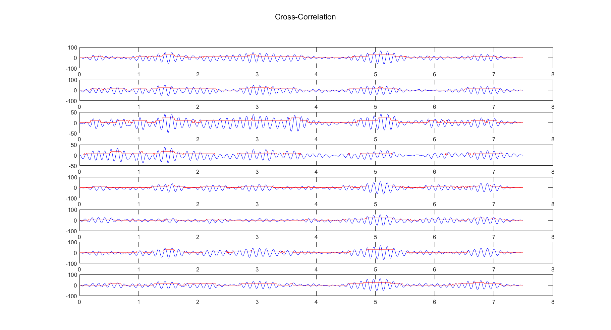

## EEG1 
Contains 8 channel simultaneous recording of EEG with 100 Hz sampling rate.
A time limited signal with alpha wave selected from this dataset and being cross-correlated with the whole signals. Parts with high absolute correlation detected as alpha wave rhythm

## EEG2
Contains 10 channel simultaneous recording of EEG with 100 Hz sampling rate.
A time limited signal with spike and complex waves selected from this dataset and cross-correlated with the whole signals to recognize this pattern in the signal

