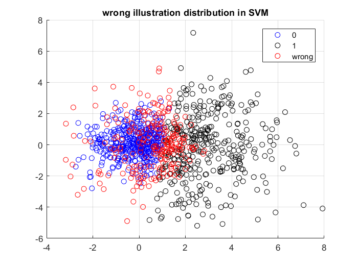
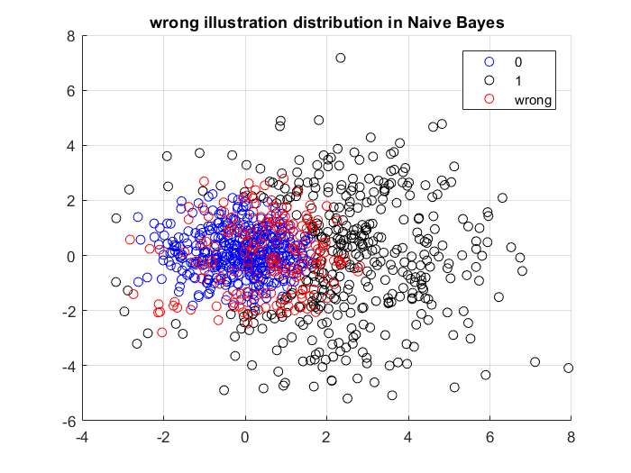
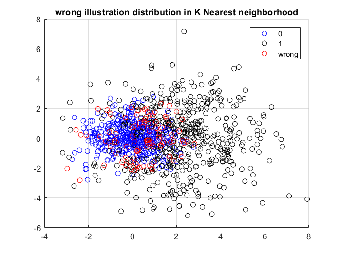

Implementation of two-class Bayesian classification, clustering using Dendrogram, compare classification result of Bayesian, Naive Bayes, Linear and nearest neighborhood. Implementation of Agglomerative Hierarchical Clustering, 2 and 3-mean clustering on Cancer Non-cancer gene information

SVM:

Naive Bayes:

Linear:

K-nearest neighborhood:

