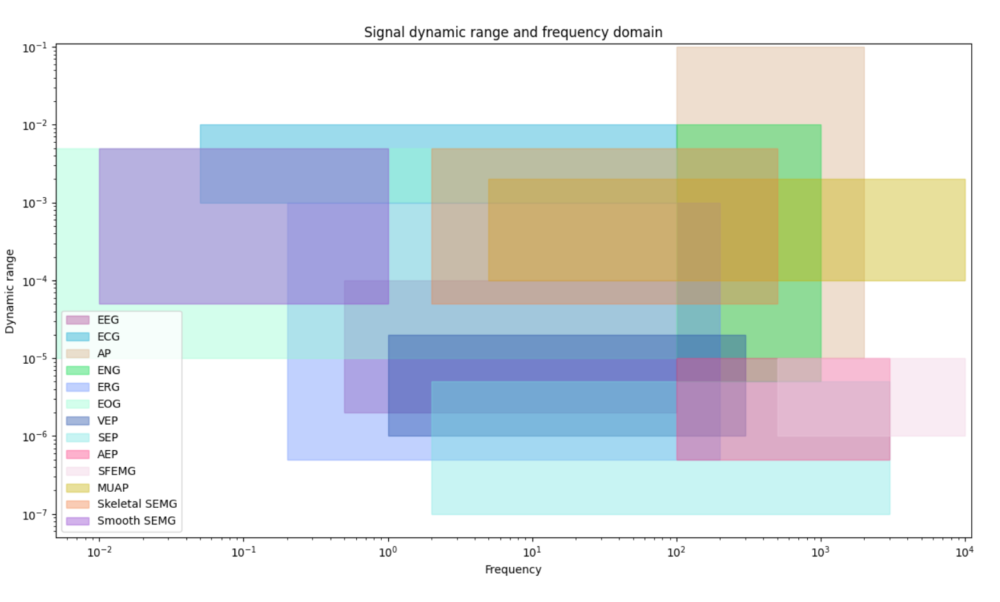

In this code, some of Biomedical signal's frequency range and dynamic range has been illustrated.

Result:

Data collected from:
* Bronzino, Joseph D. Biomedical Engineering Handbook 2. Vol. 2. Springer Science & Business Media, 2000.